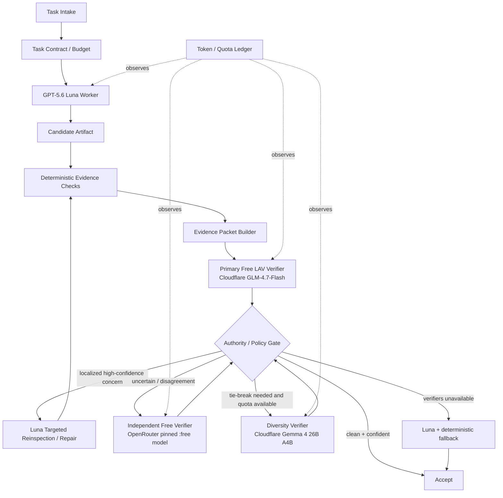

# Hermes Verifier Graph

Research project for a **verifier-gated Hermes workflow** where a capable worker such as GPT-5.6 Luna keeps ownership of the task, while free hosted verifier models inspect narrow criteria and redirect the worker toward likely mistakes.

The objective is not to replace the worker with a weaker model. The objective is to make the worker **punch above its one-pass accuracy** while adding little or no verifier inference cost.

## Core hypothesis

A weaker model can be useful at **recognition** even when it is worse at **generation**.

The graph therefore separates authority:

- **Luna owns planning, implementation, and repairs.**
- **Deterministic checks can directly reject an artifact.**
- **Cheap LLM verifiers can flag criteria and estimate confidence, but never rewrite the artifact.**
- **An independent calibrated verifier may require Luna to re-inspect a criterion, but still does not become the worker.**
- **If free verifier infrastructure is unavailable, the graph degrades to Luna + deterministic checks rather than substituting a weaker model.**

This design tries to make verifier false positives cost mostly **tokens/latency**, not **accuracy**.

## V0 architecture



## Default model roles

| Role | Baseline | Authority |
|---|---|---|
| Worker | GPT-5.6 Luna | Owns solution and all repairs. |
| Deterministic verifier | Tests, build, typecheck, schema, exact checks | May hard-reject. |
| Primary LAV verifier | Cloudflare `@cf/zai-org/glm-4.7-flash` | May flag/recommend reinspection only. |
| Independent free verifier | OpenRouter `openai/gpt-oss-20b:free` or another pinned logprob-capable `:free` model | Cross-provider confirmation; may trigger Luna reinspection only after separate calibration. |
| Diversity verifier | Cloudflare `@cf/google/gemma-4-26b-a4b-it` | Tie-break / correlated-error experiment only. |
| Paid/frontier escalation | Disabled in V0 | Experimental escape hatch only. |
| Local Ornith 35B A3B | Optional | Opportunistic verifier/benchmark when home host is reachable; never required. |

Cloudflare Workers AI currently exposes `logprobs` and `top_logprobs` for GLM-4.7-Flash and Gemma 4 26B A4B. Its Workers Free allocation is currently 10,000 neurons/day. The provider strategy deliberately treats this as a shared quota and does not assume Gemma is an independent free pool.

OpenRouter is the preferred **cross-provider free verifier pool**. The baseline pins a specific `:free` model with logprob support rather than using the random free router, because probability calibration is model-specific. Free-account request limits are much smaller than Cloudflare's token-like allocation, so OpenRouter is reserved for uncertainty and cross-checks.

Cerebras remains an optional **trial/PAYG benchmark**, not part of the recurring-free architecture. Its current documentation states that the free trial is time/credit bounded rather than permanently renewing.

## What changed from the original design

The first design assumed a strong planner + cheap worker and treated the verifier as a more authoritative judge. V0.2 reverses that relationship for the experiment we actually care about:

1. **Luna is the worker.** We measure whether cheap verification improves Luna itself.
2. **Weak verifiers are non-generative critics.** They return criterion scores and evidence references, not replacement solutions.
3. **Repairs stay with Luna.** The verifier identifies *where to think again*; Luna decides *how to fix it*.
4. **Free hosted inference is first-class.** Cloudflare is the primary recurring-free verifier route; a pinned OpenRouter `:free` model is the preferred independent escalation route.
5. **Verifier outages fail soft.** Low-risk work falls back to Luna + deterministic checks instead of blocking or downgrading to a weaker worker.
6. **Anti-regression metrics are first-class.** We explicitly measure how often verifier intervention damages an artifact that Luna had already solved correctly.
7. **Fanout is removed from the default path.** Challengers/MoA remain experimental baselines, not normal operation.

## Key safety property: monotonic artifact ownership

A verifier cannot directly mutate or replace the worker artifact.

A proposed repair becomes the new candidate only if:

1. Luna produced it,
2. previously passing hard checks still pass,
3. the targeted failed checks now pass,
4. affected verifier criteria are re-evaluated,
5. the policy gate accepts the new evidence.

If a weak verifier is wrong, the preferred outcome is an unnecessary Luna reinspection, **not a weaker-model rewrite**.

## Research questions

1. Does `Luna + deterministic checks + one cheap LAV verifier` beat Luna alone on pass@1?
2. Does targeted Luna reinspection capture most of the benefit without fixed multi-agent fanout?
3. How often does weak-verifier intervention cause a regression?
4. Does a cross-provider pinned OpenRouter free verifier materially improve difficult verifier decisions?
5. Can free verifier quotas cover realistic daily agent workloads if evidence packets stay small?
6. Which verifier family is best calibrated against Luna errors rather than strongest at general generation?
7. Does confidence-based abstention outperform a discrete PASS/FAIL judge?

## Success target

Treat these as experiment gates, not claims:

- statistically positive **net verifier lift** over Luna alone,
- verifier-induced regression rate <= 1% on objectively graded tasks,
- >= 80% of accepted tasks use only deterministic checks + the primary free verifier,
- <= 5% of total task tokens spent on LLM verification,
- no paid verifier required for the default research path,
- lower cost per solved task than fixed Hermes MoA / N=3 fanout,
- measurable improvement in success per Luna token.

## Quick start

```bash
git clone https://github.com/PetuchoDeveloper/HermesGraph.git
cd HermesGraph
# Inject provider credentials into the process environment with your secret manager.
python3 scripts/probe_verifier.py --provider cloudflare
```

The probe is only a capability check. For the automatic Phase 1 shadow path,
prepare a disposable Git repository whose baseline is clean, then run the
manifest-driven orchestrator:

```bash
mkdir -p candidate-worktree
cd candidate-worktree
git init -q
git config user.email shadow@example.invalid
git config user.name shadow
printf 'baseline\n' > README.txt
git add README.txt && git commit -qm baseline
cd ..
python3 scripts/shadow_orchestrator.py examples/shadow-manifest.example.json
```

The example manifest uses a relative TaskSpec, literal candidate paths, and a fresh artifact folder. Set `CLOUDFLARE_ACCOUNT_ID` and `CLOUDFLARE_API_TOKEN` in the process environment through a secret manager. The runner rejects `.env` input paths and never loads `.env` itself. Cloudflare requests always use the fixed `https://api.cloudflare.com` account-scoped endpoint; manifests cannot override the endpoint or headers.

Worker, hard-check, and internal Git subprocesses do not receive Cloudflare credentials. Timed-out commands are terminated as a process group. Candidate capture rejects active Git clean filters before content inspection. The artifact directory must be absent or empty, which prevents stale run data from mixing with a new run.

A missing or unusable provider falls back to deterministic checks for low/medium risk and exits nonzero for high risk. Inspect `.shadow-runs/shadow-example-001/` for `run-record.json`, the candidate diff within the optional `candidate_paths` scope, compact `evidence-packets.json`, and redacted verifier response artifacts. The verifier can request `would_reinspect`, but Phase 1 never invokes repair and never mutates the candidate on its own.

See [`QUICKSTART.md`](QUICKSTART.md) for provider setup and the first shadow-mode experiment.

## Repository map

- `docs/architecture.md` - graph contracts, authority, state, routing, and repair protocol.
- `docs/authority-model.md` - anti-regression rules and verifier authority levels.
- `docs/provider-strategy.md` - Cloudflare/OpenRouter recurring-free routing, Cerebras benchmark status, and local failover.
- `docs/evaluation.md` - Luna-focused benchmarks, calibration, and drag/uplift metrics.
- `docs/token-efficiency.md` - evidence-packet and quota-efficiency rules.
- `docs/integration-path.md` - staged Hermes integration.
- `configs/baseline.yaml` - V0.2 logical graph configuration.
- `schemas/` - task, manifest, verifier, and run-record contracts.
- `examples/` - runnable-shaped task, manifest, and evidence packet examples.
- `scripts/shadow_orchestrator.py` - automatic Phase 1 shadow runner and CLI.
- `experiments/ablation-matrix.md` - experiments needed before adding complexity.
- `ROADMAP.md` - implementation/research milestones.

## External references

- Hermes Agent delegation: https://hermes-agent.nousresearch.com/docs/user-guide/features/delegation
- Hermes Agent Mixture of Agents: https://hermes-agent.nousresearch.com/docs/user-guide/features/mixture-of-agents
- Hermes Agent code execution: https://hermes-agent.nousresearch.com/docs/user-guide/features/code-execution/
- LLM-as-a-Verifier paper: https://arxiv.org/abs/2607.05391
- LLM-as-a-Verifier code: https://github.com/llm-as-a-verifier/llm-as-a-verifier
- Cloudflare Workers AI pricing: https://developers.cloudflare.com/workers-ai/platform/pricing/
- Cloudflare GLM-4.7-Flash: https://developers.cloudflare.com/workers-ai/models/glm-4.7-flash/
- Cloudflare Gemma 4 26B A4B: https://developers.cloudflare.com/ai/models/%40cf/google/gemma-4-26b-a4b-it/
- OpenRouter free-model routing/limits: https://openrouter.ai/openrouter/free
- Cerebras rate limits (trial/PAYG benchmark only): https://inference-docs.cerebras.ai/support/rate-limits
